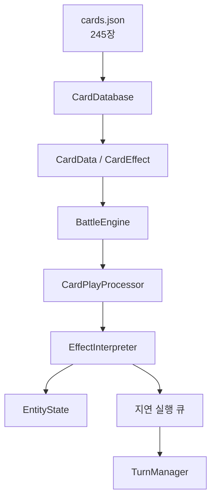
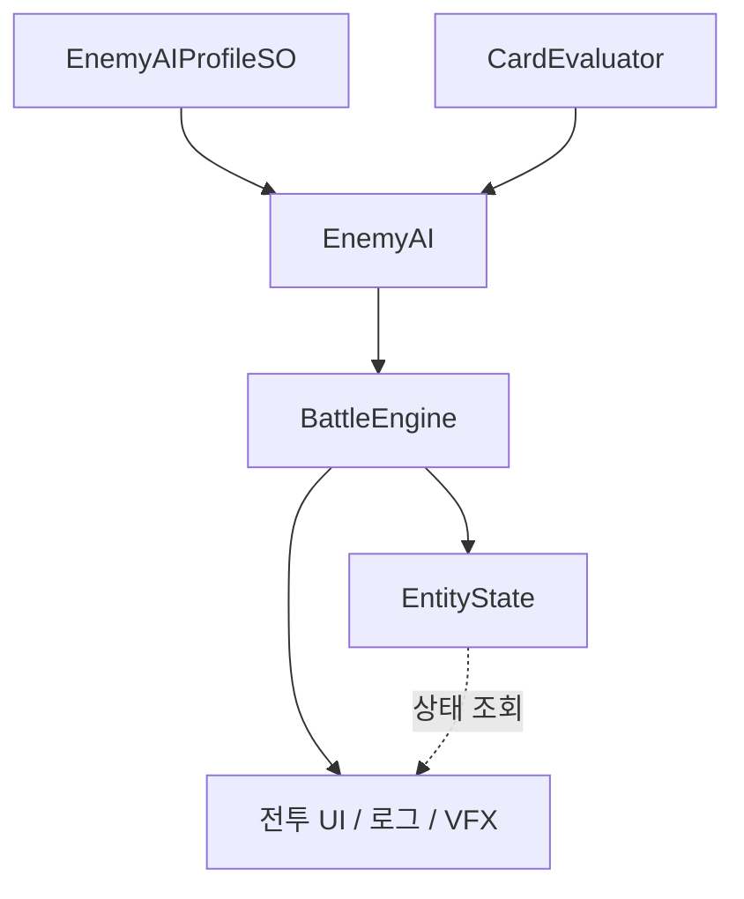

# 신디게이트: 서울 — 카드 배틀 시스템

> **Unity/C#으로 구현한 데이터 기반 카드 전투 시스템** 
> 3인 팀의 카드 전투 영역에서 기획부터 전투 엔진, 효과 실행기, 적 AI, UI 구현까지 담당했습니다.

도시 경영과 카드 전투를 결합한 팀 프로젝트의 전투 시스템입니다.

**[게임 다운로드 (Google Drive)](https://drive.google.com/drive/folders/1G7LdRDg02FU4Szg6Tx1DRVeOm7Zii8Cy?hl=ko)**

| 구분 | 내용 |
|---|---|
| 개발자 | 함대영 · [@HolicKW](https://github.com/HolicKW) |
| 개발 기간 | 2026.02–2026.06 |
| 팀 구성 | 3인 — 경영 기획 1 · 아트 1 · 카드 전투 기획·구현 1 |
| 담당 | 카드 전투 영역 기획·구현 단독 담당 — 전투 로직 · 적 AI · UI/UX · 카드 데이터 |
| 기술 | Unity 6 · C# · URP · Unity Test Framework(NUnit) |

[핵심 구현](#핵심-구현) · [설계](#설계) · [문제 해결](#문제-해결) · [테스트](#테스트) · [소스 안내](#소스-안내)

전투 코드·데이터 발췌본으로 단독 실행은 지원하지 않습니다. [원본 프로젝트](https://github.com/HolicKW/NewWorld)

---

## 핵심 구현

**카드 245장 · 7개 팩 · 사용 효과 타입 114종**을 데이터와 실행 로직으로 분리했습니다.
효과 레지스트리는 별칭을 포함한 **151개 키**를 지원합니다.

| 영역 | 구현 내용 | 코드 |
|---|---|---|
| 전투 엔진 | 카드 사용, 피해·방어도, 드로우, 카드 소모·회수, 연속 사용·지속 효과 처리 | [`BattleEngine.cs`](Assets/Scripts/Battle/BattleEngine.cs) |
| 이펙트 시스템 | 데이터 효과 디스패치, 지연 실행, 예외·재귀 안전장치 | [`EffectInterpreter.cs`](Assets/Scripts/Battle/EffectInterpreter.cs) |
| 턴·상태 | 턴 시퀀스, 지연 큐, 턴 한정 카운터, 양 진영 공통 상태 | [`TurnManager.cs`](Assets/Scripts/Battle/TurnManager.cs) · [`EntityState.cs`](Assets/Scripts/Battle/EntityState.cs) |
| 적 AI | 카드 기대값 평가와 성격 기반 전략 가중치 | [`CardEvaluator.cs`](Assets/Scripts/Battle/CardEvaluator.cs) · [`EnemyAI.cs`](Assets/Scripts/Battle/EnemyAI.cs) |
| 전투 UI/UX | 손패, 드래그·호버, 시작 손패 교체, 툴팁, 로그, VFX | [`Assets/Scripts/Cards`](Assets/Scripts/Cards) |
| 카드 데이터 | 7개 팩, 245장, 사용 효과 타입 114종 | [`cards.json`](Assets/Resources/cards.json) |

---

## 설계

| 설계 선택 | 목적과 적용 |
|---|---|
| 데이터와 실행 로직 분리 | 기존 효과를 조합한 카드는 JSON만 수정하고, 새 동작만 C# 핸들러로 추가 |
| 플레이어·적 공통 모델 | `EntityState`와 카드 실행 경로를 공유해 양 진영의 규칙 중복 방지 |
| 턴 상태 격리 | 턴 한정 카운터를 구조체로 묶고 `default`로 일괄 초기화해 필드 추가 시 리셋 누락 방지 |
| 평가 함수와 행동 정책 분리 | 카드 효과를 9개 가치 축으로 평가하고, 성격 기반 전략 가중치를 에디터에서 조정 |

구조도 — 카드 실행 경로와 AI·UI 연결

### 카드 실행 경로

### AI와 표현 계층

---

## 문제 해결

| 문제 | 구현한 대응 | 근거 코드 |
|---|---|---|
| 효과 오류가 상위 카드 실행으로 전파 | 핸들러 단위 예외 처리와 미등록 타입 로그로 오류 위치 식별 | [`EffectInterpreter.Execute`](Assets/Scripts/Battle/EffectInterpreter.cs) |
| 중첩 효과의 무제한 재귀 위험 | 실행 깊이 10 초과 시 중단하고 `finally`에서 깊이 복원 | [`EffectInterpreter.ExecuteAll`](Assets/Scripts/Battle/EffectInterpreter.cs) |
| 카드 설명과 현재 피해 수치의 불일치 | 버프·스택·누적 카운트를 반영한 설명문 치환과 기대값 테스트 | [`CardData.cs`](Assets/Scripts/CardData.cs) · [`CardDataDescriptionTests.cs`](Assets/Scripts/Cards/Editor/CardDataDescriptionTests.cs) |

예외 처리는 오류 전파를 제한하지만 이미 반영된 상태를 되돌리지는 않습니다.
문자열 효과 키의 오타를 실행 전에 찾는 JSON 검증과, 오류 시 상태 복구 정책은 개선 과제로 남겼습니다.

---

## 전투 UI/UX

| 기능 | 구현 목적 |
|---|---|
| 손패 부채꼴 레이아웃 | 카드 수에 따라 각도·간격·높이를 조정해 겹침과 화면 이탈 방지 |
| 키워드 툴팁 | 14종 키워드의 중앙 정의를 읽어 설명 자동 생성 |
| 조건 충족 오라 | 조건부 카드의 활성 여부를 청록색 펄스로 표시 |
| 전투 로그 | 카드 사용, 피해, 상태 변화, 경고를 한 흐름으로 추적 |
| 선택 모드 | 시작 손패 교체·카드 소모 대상의 선택 상태와 확정 단계 분리 |

VFX는 도박 실패의 글리치, 해체의 데이터 분해처럼 **규칙과 결과를 전달하는 시각 피드백**으로 설계했습니다.

---

## 테스트

Unity Test Framework(NUnit) 기반 **에디터 테스트 코드 104개**를 포함합니다.
피해 계산, 상태 변화, 효과 처리 순서 등 규칙 경계를 중심으로 작성했습니다.

| 영역 | 케이스 | 주요 검증 |
|---|---:|---|
| 이펙트 핸들러 | 44 | 피해·실드·조건 분기·스케일링 |
| 턴·반격 처리 | 23 | 상태 감소, 드로우, 처리 순서, 반격 상호작용 |
| 덱·설명·툴팁 | 24 | 드로우·폐기·리셔플, 동적 수치, 키워드 출력 |
| 코어·기타 연동 | 13 | 지속 효과, DB 로딩, 버프 요약, 덱 감염 |

테스트 코드: [`Assets/Scripts/Cards/Editor`](Assets/Scripts/Cards/Editor)

별도로 카드 전투 컨셉을 기획·구현한 뒤 [밸런스 시뮬레이터](https://github.com/HolicKW/card-simulator)의
AI 반복 전투 결과를 점검했습니다. 로직의 기대값을 확인하는 단위 테스트와 카드 성능을 비교하는 밸런스 점검을 구분했습니다.

---

## 코드 살펴보기

1. [`BattleEngine.cs`](Assets/Scripts/Battle/BattleEngine.cs) — 전투 흐름과 상태 변경 진입점
2. [`CardPlayProcessor.cs`](Assets/Scripts/Battle/CardPlayProcessor.cs) — 카드 한 장의 실행 파이프라인
3. [`EffectInterpreter.cs`](Assets/Scripts/Battle/EffectInterpreter.cs) — 효과 디스패치와 안전장치
4. [`EntityState.cs`](Assets/Scripts/Battle/EntityState.cs) — 양 진영 공통 상태 모델
5. [`CardEvaluator.cs`](Assets/Scripts/Battle/CardEvaluator.cs) — AI 카드 가치 평가
6. [`EffectHandlerTests.cs`](Assets/Scripts/Cards/Editor/EffectHandlerTests.cs) — 전투 규칙 테스트

---

## 소스 안내

이 저장소는 팀 프로젝트에서 카드 전투 코드와 데이터를 발췌한 소스입니다.
씬·프리팹·에셋과 일부 공용 타입이 제외되어 단독 빌드·실행 및 테스트 실행은 지원하지 않습니다.

원본 프로젝트 공개 미러: [HolicKW/NewWorld](https://github.com/HolicKW/NewWorld)
