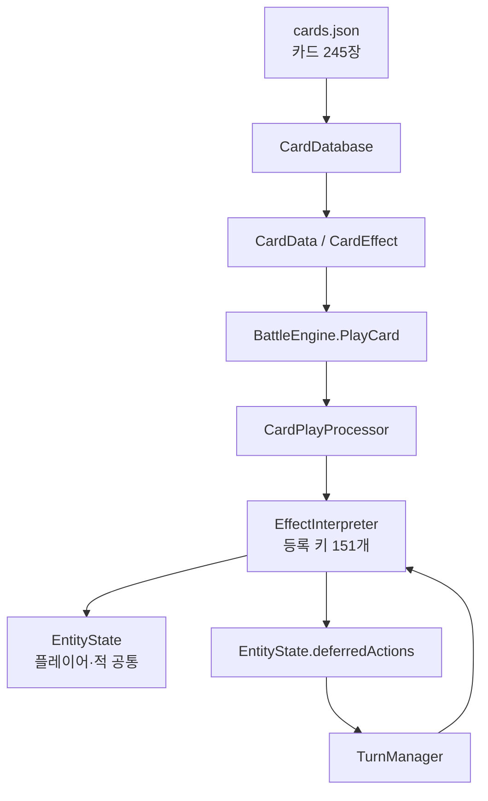
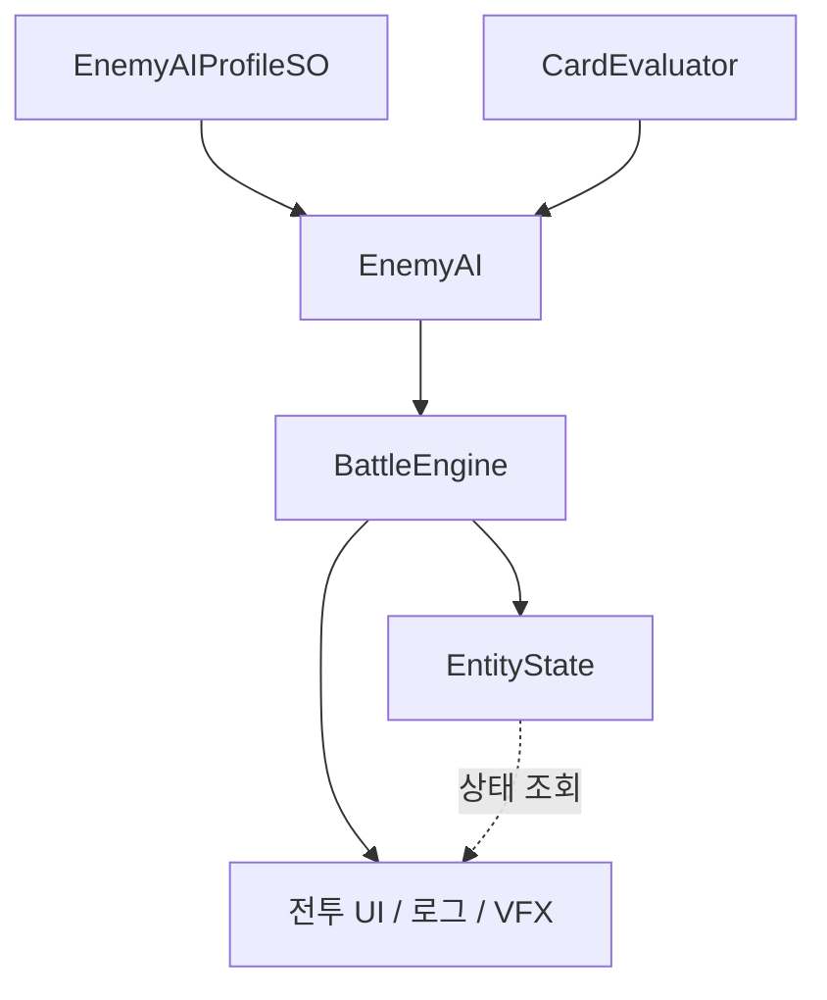

# 신디게이트: 서울 — 카드 배틀 시스템

> **245장의 카드를 데이터로 운용하는 Unity 카드 배틀 엔진과 전투 UI를 설계·구현했습니다.**<br>
> 3인 팀에서 카드 전투 영역의 기획과 구현을 단독 담당한 포트폴리오 스냅샷입니다.

[](https://unity.com/)
[](Assets/Resources/cards.json)
[](Assets/Resources/cards.json)
[](Assets/Scripts/Cards/Editor)

**담당자** 함대영 · [@HolicKW](https://github.com/HolicKW)<br>
**담당 범위** 카드 전투 컨셉·시스템 기획 · 전투 엔진·적 AI·UI/UX 구현 · 밸런스 점검<br>
**기술** Unity 6 · C# · URP · Unity Test Framework(NUnit)<br>
**개발 기간** 2026.02–2026.06 · 3인 팀(경영 기획 1 · 아트 1 · 카드 전투 기획·구현 1)

[핵심 구현](#핵심-구현) · [아키텍처](#아키텍처) · [문제 해결](#기술적-문제-해결) · [기획·밸런싱](#기획과-밸런스-검증) · [테스트](#테스트와-품질-관리) · [코드 살펴보기](#코드-살펴보기)

---

## 구현 내용 요약

| 규모 | 설계 | 품질 |
|---|---|---|
| 카드 **245장** | 데이터 주도 이펙트 시스템 | 에디터 단위 테스트 **104개** |
| 등록 효과 키 **151개** | 플레이어·적 대칭 상태 모델 | 핸들러 예외 격리 및 전투 로그 |
| 카드 팩 **7종** | Big Five 기반 전략형 적 AI | 재귀·교착·턴 상태 안전장치 |

이 프로젝트에서 저는 카드 배틀 영역 전체를 맡았습니다. 카드 데이터 구조와 전투 규칙부터 효과 실행기,
턴 관리, 적 AI, 손패·툴팁·전투 로그·VFX까지 하나의 흐름으로 설계하고 구현했습니다.

### 제가 해결한 핵심 과제

- **확장성** — 카드 데이터와 실행 로직을 분리해, 기존 효과를 조합한 카드는 JSON만으로 추가·조정했습니다.
- **일관성** — 플레이어와 적이 같은 상태 모델과 카드 실행 파이프라인을 사용하도록 구성했습니다.
- **안정성** — 카드 한 장의 오류, 효과 순환 참조, 덱 소진 교착이 전투 전체를 멈추지 않게 했습니다.
- **가독성** — 조건 충족 오라와 동적 카드 설명으로 플레이어가 현재 결과를 계산하지 않아도 알 수 있게 했습니다.

> [!IMPORTANT]
> 이 저장소는 원본 팀 프로젝트에서 제가 작성한 카드 배틀 관련 코드와 데이터만 분리한 **열람용 스냅샷**입니다.
> 아트, 음원, 프리팹, 씬과 일부 공용·도시 경영 타입은 포함하지 않아 이 저장소만으로는 컴파일·실행할 수 없습니다.

---

## 핵심 구현

| 영역 | 구현 내용 | 대표 코드 |
|---|---|---|
| 전투 엔진 | 카드 사용, 피해·실드, 드로우·해체, 프로토콜, 코어 트리거 | [`BattleEngine.cs`](Assets/Scripts/Battle/BattleEngine.cs) |
| 이펙트 시스템 | 문자열 타입을 151개 등록 키로 디스패치, 재귀·예외 안전장치 | [`EffectInterpreter.cs`](Assets/Scripts/Battle/EffectInterpreter.cs) |
| 턴·상태 관리 | 턴 시퀀스, 지연 실행 큐, 턴 한정 카운터 초기화 | [`TurnManager.cs`](Assets/Scripts/Battle/TurnManager.cs) · [`EntityState.cs`](Assets/Scripts/Battle/EntityState.cs) |
| 적 AI | 카드 기대값 평가와 성격 기반 전략 가중치 분리 | [`CardEvaluator.cs`](Assets/Scripts/Battle/CardEvaluator.cs) · [`EnemyAI.cs`](Assets/Scripts/Battle/EnemyAI.cs) |
| 전투 UI/UX | 손패 레이아웃, 드래그·호버, 멀리건, 툴팁, 로그, VFX | [`Assets/Scripts/Cards`](Assets/Scripts/Cards) |
| 카드 데이터 | 7개 팩, 245장, 114종의 사용 중인 효과 타입 | [`cards.json`](Assets/Resources/cards.json) |

> 레지스트리에는 별칭을 포함해 **151개의 효과 키**가 등록되어 있고, 현재 `cards.json`에서는 그중 **114개를 사용**합니다.

---

## 아키텍처

### 카드 실행 경로



### AI와 표현 계층



### 1. 데이터 주도 이펙트 시스템

카드의 메타데이터와 효과 구성은 JSON으로 관리하고, 실제 동작은 C# 핸들러가 실행합니다.
기존 효과 타입을 조합한 카드는 JSON만으로 추가·조정하며, 새로운 효과 동작이 필요할 때만 별도 partial 핸들러를
추가하도록 분리했습니다.

```json
{
  "id": "BASE_002",
  "cardName": "연속 타격",
  "type": "Attack",
  "cost": 1,
  "effects": [{ "type": "damage", "value": 3, "hits": 2 }],
  "description": "적에게 {d:3}의 피해를 2번 줍니다."
}
```

```text
CardData.effects
      ↓
ExecuteAll(effects, context)  ── 순차 실행 / 재귀 깊이 제한
      ↓
handlers[effect.type]         ── 151개 등록 키 중 하나로 디스패치
      ├─ 즉시 실행 → EntityState 갱신
      └─ 지연 실행 → turnEnd / nextTurnStart 큐 등록
```

핸들러는 복잡도와 카드 팩에 따라 10개의 partial 파일로 나눴습니다. 바이오해저드 카드 40장의 전용 동작은
[`EffectInterpreter.BiohazardHandlers.cs`](Assets/Scripts/Battle/EffectInterpreter.BiohazardHandlers.cs)에 모으고,
중앙 등록 메서드에서 연결해 다른 팩의 구현과 분리했습니다.

### 2. 플레이어·적 대칭 모델

플레이어와 적은 동일한 [`EntityState`](Assets/Scripts/Battle/EntityState.cs)를 사용합니다.
적 AI도 별도의 효과 처리기를 두지 않고 플레이어와 같은 카드 실행 경로를 호출합니다.

이 구조로 얻은 효과는 다음과 같습니다.

- 피해, 반격, 관통 같은 효과가 양방향에서 같은 규칙으로 동작합니다.
- 실제 카드 효과 실행 규칙은 양 진영이 공유하며, AI에는 별도의 평가 휴리스틱만 둡니다.
- 전투 규칙 계층을 양 진영에서 재사용하고, UI·로그 계층에서 플레이어와 적을 구분할 수 있습니다.

### 3. 턴 한정 상태의 안전한 초기화

전투 중에는 자해량, 도박 성공 횟수, 다음 공격 보너스처럼 한 턴만 유지되는 상태가 34개 존재합니다.
개별 필드를 수동 초기화하면 새 필드를 추가할 때 리셋을 빠뜨리기 쉬웠습니다.

```csharp
public struct TurnCounters
{
    public int selfDamageThisTurn, cardsPlayedThisTurn, nextAttackBonus;
    public bool armorPierceNextAttack, invincibleThisTurn;
    // ...
}

public void ResetTurnCounters() => Turn = default;
```

턴 상태를 `struct`로 격리하고 각 엔티티의 턴 시작 시 `default`로 초기화해,
필드가 늘어나도 리셋 누락이 생기지 않도록 만들었습니다.

### 4. 밸런싱 가능한 적 AI

초기 AI의 하드코딩된 우선순위를 **평가 함수**와 **행동 정책**으로 분리했습니다.

1. `CardEvaluator`가 카드 효과를 피해, 실드, 회복, 드로우 등 9개 가치 축의 휴리스틱 추정치로 환산하고,
   지원하지 않는 효과에는 별도 페널티를 기록합니다.
2. `EnemyAI`가 전략별 가중치 벡터를 곱해 최종 점수를 계산합니다.
3. 가중치는 `EnemyAIProfileSO`로 노출해 코드 수정 없이 에디터에서 조정합니다.
4. 프로필의 Big Five 성격값이 Aggressive / Defensive / Balanced / Random 전략으로 이어집니다.

원본 프로젝트에서는 경영 영역의 CEO 성격값을 전투 AI에 전달하고,
`EnemyAIProfileSO`의 전략별 가중치와 결합해 캐릭터 설정과 전투 행동의 방향을 맞췄습니다.

---

## 기술적 문제 해결

### 카드 한 장의 오류가 전투 전체를 멈추는 문제

**문제** — 핸들러 하나에서 예외가 발생하면 카드 사용 콜스택이 끊기고 전투 입력까지 멈췄습니다.

**해결** — 핸들러 단위로 예외를 격리하고, 미등록 타입과 예외를 개발자 콘솔뿐 아니라 인게임 전투 로그에도 남겼습니다.

**결과** — 미등록 타입이나 핸들러 예외가 발생하면 해당 효과만 중단하고 전투 루프와 다음 입력은 유지합니다.
오류를 인게임 로그에 기록해 JSON 타입 오타도 테스트 플레이 중 식별할 수 있게 했습니다.

```csharp
if (!handlers.TryGetValue(ctx.Effect.type, out var handler))
{
    BattleLogger.Log(BattleLogType.Warning, $"미등록 핸들러: {ctx.Effect.type}");
    return;
}

try { handler(ctx); }
catch (Exception ex)
{
    BattleLogger.Log(BattleLogType.Warning, $"핸들러 예외: {ex.Message}");
}
```

### 카드 효과의 순환 참조 문제

**문제** — 해체가 다른 카드의 효과를 호출하고 재구축이 파괴된 카드를 되살리면서 A → B → A 순환이 발생했습니다.

**해결** — 실행 컨텍스트에 재귀 깊이 제한 10을 두고, 전투 종료 및 후속 효과 중단 조건을 매 실행 단계에서 확인했습니다.

**결과** — 잘못된 조합이 Unity 에디터를 스택 오버플로로 종료시키지 않고 안전하게 중단됩니다.

### 양쪽 덱 소진으로 발생한 무한 전투

**문제** — 양쪽 드로우 파일이 모두 비면 누구도 행동하지 못한 채 턴만 반복됐습니다.

**해결** — 원본 프로젝트에서는 임의 타임아웃 대신 특수 카드 **발버둥**을 게임 규칙으로 추가했습니다.
덱이 비면 손패에 들어오고,
다음 턴까지 남아 있으면 최대 체력의 10% 피해를 줍니다.

**결과** — 덱 소진 상태가 지속될수록 전투 종료 압력이 커지며, 상대 덱 소진을 유도하는 선택지도 규칙상 가능해졌습니다.

> 이 스냅샷에는 [`TurnManager.cs`](Assets/Scripts/Battle/TurnManager.cs)의 처리 로직만 포함되어 있으며,
> `STATUS_STRUGGLE` 특수 카드 데이터는 포함되어 있지 않습니다.

### 카드 설명과 실제 피해량의 불일치

**문제** — 힘, 약화, 오버클럭 스택에 따라 실제 수치가 바뀌어 카드 설명만 보고 결과를 예측하기 어려웠습니다.

**해결** — `{d:6}` 같은 플레이스홀더를 표시 직전에 현재 상태로 계산하는 치환기를 구현했습니다.

**검증** — [`CardDataDescriptionTests.cs`](Assets/Scripts/Cards/Editor/CardDataDescriptionTests.cs)의 7개 테스트로
버프, 스택 곱연산, 누적 카운트와 기본값을 고정했습니다.

---

## 전투 UI/UX

| 기능 | 사용자 문제 | 구현 |
|---|---|---|
| 손패 부채꼴 레이아웃 | 카드가 많을 때 겹침과 화면 이탈 | 카드 수에 따라 각도·간격·높이를 동적 계산하고 전체 각도에 상한 적용 |
| 키워드 툴팁 | 14종 규칙을 카드마다 반복 설명 | 카드의 키워드 배열을 읽어 중앙 정의에서 툴팁 자동 생성 |
| 조건 충족 오라 | 조건부 카드의 현재 효율을 매번 계산 | 조건을 만족한 카드에 청록색 펄스 효과 제공 |
| 전투 로그 | 복합 효과의 원인 추적이 어려움 | 카드명 링크, 경고, 피해·상태 변화를 한 흐름으로 기록 |
| 멀리건·해체 선택 | 선택 상태와 확정 시점을 알기 어려움 | 대상 강조, 선택 모드, 확정 단계를 명확히 분리 |

[`HandFanLayout.cs`](Assets/Scripts/Cards/HandFanLayout.cs) ·
[`KeywordTooltipBuilder.cs`](Assets/Scripts/Cards/KeywordTooltipBuilder.cs) ·
[`HandCardUI.cs`](Assets/Scripts/Cards/HandCardUI.cs) ·
[`BattleLogUI.cs`](Assets/Scripts/Cards/BattleLogUI.cs)

VFX는 장식보다 규칙 전달을 우선했습니다. 도박 실패에는 글리치, 해체에는 데이터 조각 분해 연출을 사용해
사이버펑크 세계관과 행동 결과가 같은 시각 언어를 갖도록 했습니다.

---

## 기획과 밸런스 검증

카드 전투의 컨셉과 규칙을 먼저 기획하고, 실제 전투 시스템과 카드 데이터로 구현한 뒤
별도 밸런스 도구로 반복 전투 결과를 점검했습니다. 기획과 구현을 함께 담당해 시스템 제약을 플레이 선택으로
전환하고, 구현 가능한 규칙인지 코드 단계에서 빠르게 검증했습니다.

### 컨셉을 플레이 규칙으로 구현

| 카드 팩 | 핵심 메커니즘 | 플레이 감각 |
|---|---|---|
| BASE | 기본 공격·방어 | 안정적인 학습 |
| 오버클럭 | 스택에 따른 배율 증가와 자해 | 고위험·고수익 |
| 해체 | 카드를 파괴해 즉시 이득, 재구축으로 회수 | 자원 순환 |
| 네트워크 | 연속 사용 시 프로토콜 발동 | 콤보 구성 |
| 바이오해저드 | 바이러스·부식 누적 피해 | 장기전 압박 |
| 러시안 룰렛 | 확률 판정과 행운·불운 스택 | 위험 관리 |

위 6개 전투 덱 아키타입에 도시 경영의 특허와 연동되는 **IP 카드 5장**을 더해 총 7개 팩으로 구성했습니다.

오버클럭의 자해, 도박의 실패, 해체의 카드 소모처럼 강한 이득에는 명확한 비용을 붙였습니다.
매 턴 “지금 위험을 감수할 것인가”를 판단하게 만드는 것이 전투 설계의 중심입니다.

### 구현 후 밸런스 점검

구현된 카드와 전투 규칙은 별도 브라우저 도구인
[`HolicKW/card-simulator`](https://github.com/HolicKW/card-simulator)에서 AI 반복 전투로 점검했습니다.
AI가 덱을 구성해 PvE 또는 AI 대 AI 미러 매치를 진행하고, 카드별 승률·사용률·학습 가중치와 S–F 등급을
비교하도록 구성했습니다. 이 결과는 밸런스를 자동 확정하는 값이 아니라, 과도하게 강하거나 약한 카드와
팩 간 편차를 찾아 카드 수치와 비용을 다시 검토하는 근거로 사용했습니다.

---

## 테스트와 품질 관리

Unity Test Framework(NUnit) 기반 **에디터 모드 단위 테스트 104개**를 작성했습니다.
커버리지 숫자보다 실제 결함 위험이 높은 규칙 경계에 집중했습니다.

> 여기서 테스트는 Unity Editor에서 전투 로직의 기대 결과를 자동 검증하는 코드 단위 테스트입니다.
> 카드 밸런스 평가는 위의 반복 전투 시뮬레이션과 구분했습니다.

| 테스트 영역 | 케이스 | 검증 대상 |
|---|---:|---|
| 이펙트 핸들러 | 44 | 피해·실드·조건 분기·스케일링 |
| 턴 매니저 | 12 | 상태 감소, 실제 드로우 수, 랜섬웨어 처리 타이밍 |
| 반격 처리 | 11 | 공격·피격·반격 상호작용 |
| 키워드 툴팁 | 9 | 키워드 탐지와 출력 형식 |
| 덱 매니저 | 8 | 드로우, 폐기, 리셔플 |
| 동적 설명문 | 7 | 상태 기반 수치 치환 |
| 코어 매니저 | 6 | 지속 효과 트리거 |
| 기타 | 7 | DB 로딩, 버프 요약, 덱 감염, 카드 연동 |

문자열 키 기반 시스템은 유연하지만 컴파일러가 오타를 잡지 못합니다. 이를 보완하기 위해 다음 방어선을 뒀습니다.

- 미등록 핸들러와 실행 예외를 런타임 로그로 노출
- 재귀 깊이와 AI 턴당 카드 사용 횟수 제한
- 턴 한정 상태의 일괄 초기화
- 효과 핸들러, 설명문 치환, 턴 타이밍 중심의 회귀 테스트

테스트 코드는 [`Assets/Scripts/Cards/Editor`](Assets/Scripts/Cards/Editor)에서 확인할 수 있습니다.

---

## 회고

### 잘한 결정

- **데이터와 실행 로직을 분리한 것** — 기존 효과 조합으로 구성된 카드의 수치와 구성을 JSON에서 조정해,
  후반 밸런싱 시 매번 C#을 수정하지 않아도 되도록 했습니다.
- **플레이어와 적을 같은 모델로 만든 것** — 규칙의 중복을 없애고 진영 전환형 모드의 확장 비용을 낮췄습니다.
- **교착을 게임 규칙으로 해결한 것** — 방어 코드로 숨기지 않고 플레이어가 이해하고 활용할 수 있는 콘텐츠로 전환했습니다.

### 개선할 점

- `BattleInitializer`에 초기화, UI 생성, 멀리건, 이벤트 바인딩 책임이 집중됐습니다. 다시 설계한다면
  조합 루트와 기능별 프레젠터를 초기에 분리하겠습니다.
- 문자열 효과 타입은 확장성이 높은 대신 타입 안전성이 낮습니다. 에디터 단계 JSON 스키마 검증 또는
  효과 타입 상수 코드 생성을 추가해 오류를 더 일찍 발견할 수 있습니다.

이 프로젝트를 통해 “미래를 위한 추상화”보다 **반복해서 증가할 축을 정확히 식별하는 설계**가 중요하다는 것을 배웠습니다.

---

## 코드 살펴보기

처음 방문했다면 아래 순서로 읽는 것을 권장합니다.

1. [`BattleEngine.cs`](Assets/Scripts/Battle/BattleEngine.cs) — 전투 전체 흐름과 상태 변경 진입점
2. [`CardPlayProcessor.cs`](Assets/Scripts/Battle/CardPlayProcessor.cs) — 카드 한 장이 실행되는 파이프라인
3. [`EffectInterpreter.cs`](Assets/Scripts/Battle/EffectInterpreter.cs) — 데이터 효과의 디스패치와 안전장치
4. [`EntityState.cs`](Assets/Scripts/Battle/EntityState.cs) — 대칭 상태 모델과 턴 카운터
5. [`CardEvaluator.cs`](Assets/Scripts/Battle/CardEvaluator.cs) — AI가 카드 가치를 계산하는 방식
6. [`EffectHandlerTests.cs`](Assets/Scripts/Cards/Editor/EffectHandlerTests.cs) — 전투 규칙의 기대 동작

<details>
<summary><strong>디렉터리 구조 펼쳐보기</strong></summary>

```text
Assets/
├── Resources/
│   └── cards.json                    # 카드 데이터 245장
└── Scripts/
    ├── Battle/
    │   ├── BattleEngine.cs           # 전투 오케스트레이터
    │   ├── CardPlayProcessor.cs      # 카드 사용 파이프라인
    │   ├── EffectInterpreter*.cs     # 이펙트 실행기와 핸들러
    │   ├── TurnManager.cs            # 턴 시퀀스
    │   ├── CoreManager*.cs           # 지속 효과 트리거
    │   ├── EntityState.cs            # 공통 전투 상태
    │   ├── CardEvaluator.cs          # 카드 기대값 평가
    │   └── EnemyAI.cs                # 전략 선택 AI
    ├── Cards/
    │   ├── HandCardUI.cs             # 카드 상호작용과 조건 오라
    │   ├── HandFanLayout.cs          # 손패 레이아웃
    │   ├── BattleLogUI.cs            # 전투 로그
    │   ├── KeywordTooltipBuilder.cs  # 키워드 툴팁
    │   └── Editor/                    # 에디터 테스트 104개
    └── CardData.cs                   # 카드 모델과 동적 설명문
```

</details>

---

## 원본 저장소

공개 미러: [HolicKW/NewWorld](https://github.com/HolicKW/NewWorld)
